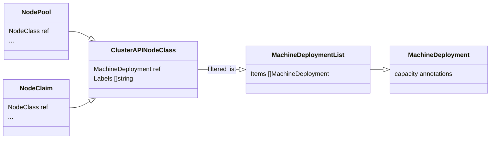
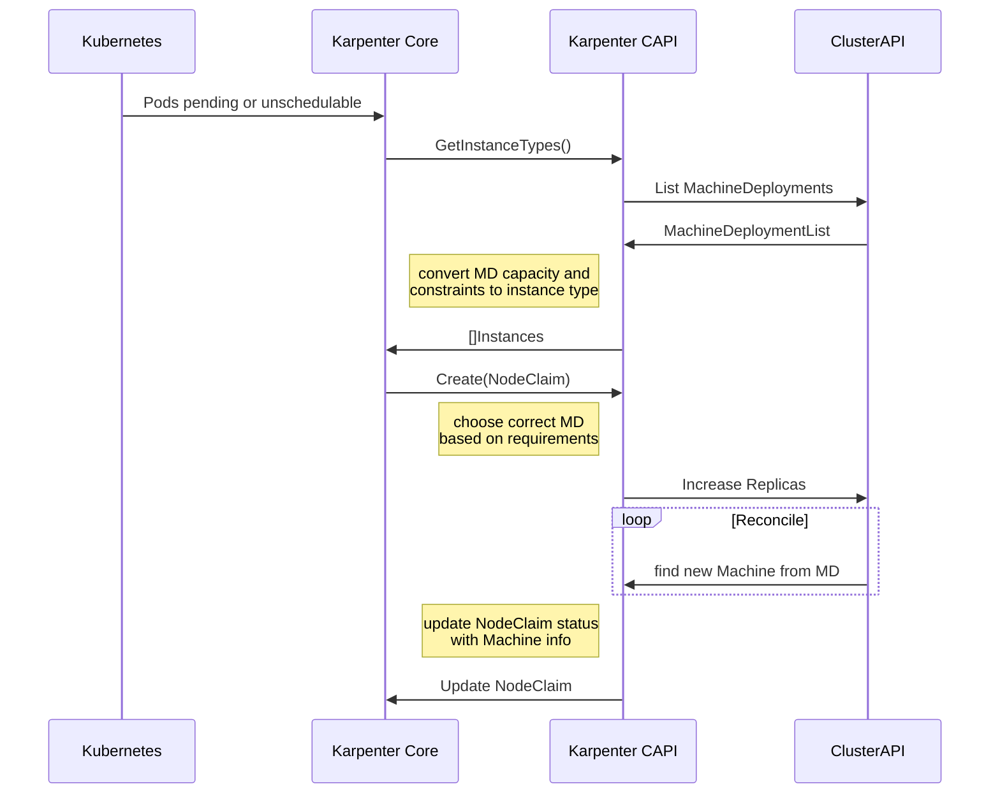
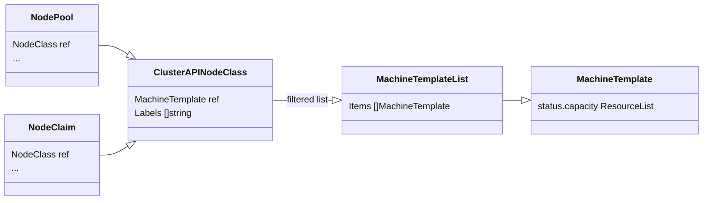
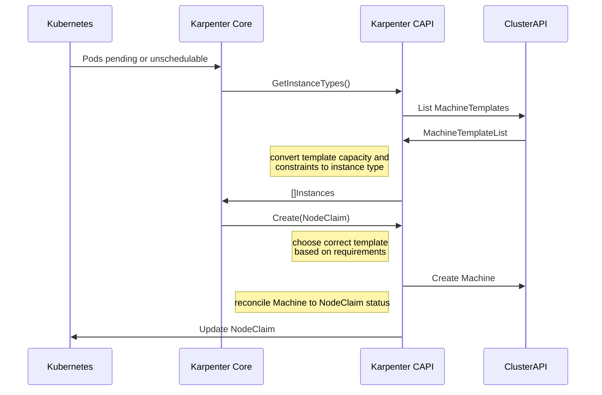

# Design

As of the first half of 2024, this project is under active design and experimentation.
The documentation here captures some of the design notes and decisions.

## MachineDeployment

After the discussions on [4 April 2024][april4], we are revisiting the idea of using MachineDeployments as the backing implemetation detail for NodeClaims. The diagrams here are updated to reflect those changes.

Of note:

* The ClusterAPINodeClass will contain a reference to a type of MachineDeployment not a specific resource.
* The labels in the ClusterAPINodeClass will be used as inclusive filters for finding MachineDeployments
* The capacity annotations on the MachineDeployment are the same as the [scale from zero][sfz] annotations.

general resource relationships

a possible workflow for creating new instances

## InfrastructureMachineTemplate

The section highlights a design pattern that uses an orphan machine methodology to create instances for NodeClaims.
This design was [presented at the 4 April 2024 office hours][april4] - [slides](assets/Proof of Concept Architecture for Karpenter Cluster API.pdf).

This is a class diagram showing the relationships between the Karpenter
and Cluster API CRDs.

This is the sequence diagram for what a request to create a new Node might
look like.

[april4]: https://youtu.be/xINYfl5j8WI?si=PiWu7MeaXy3SWGKX&t=1281
[sfz]: https://github.com/kubernetes-sigs/cluster-api/blob/main/docs/proposals/20210310-opt-in-autoscaling-from-zero.md
