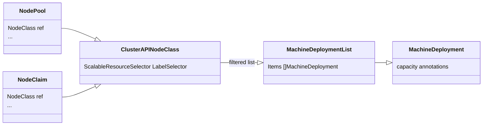
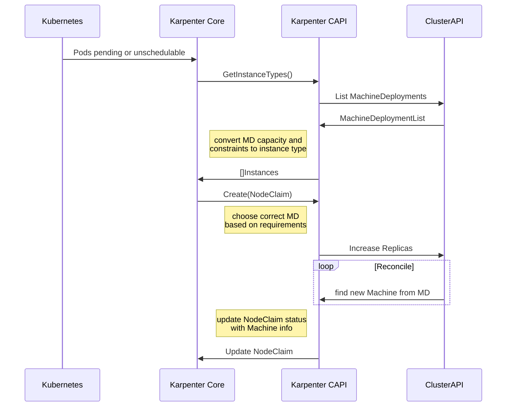
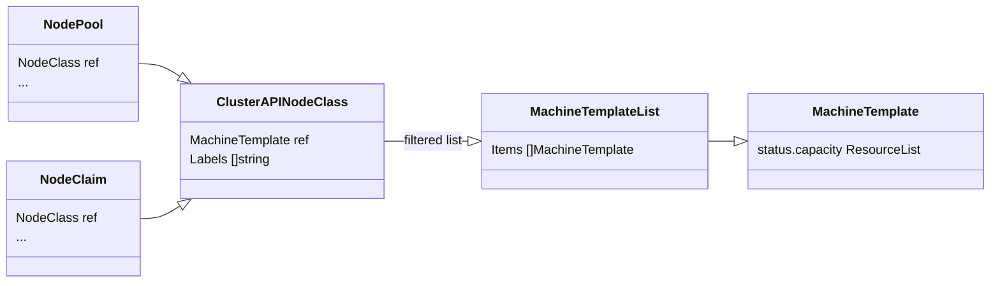
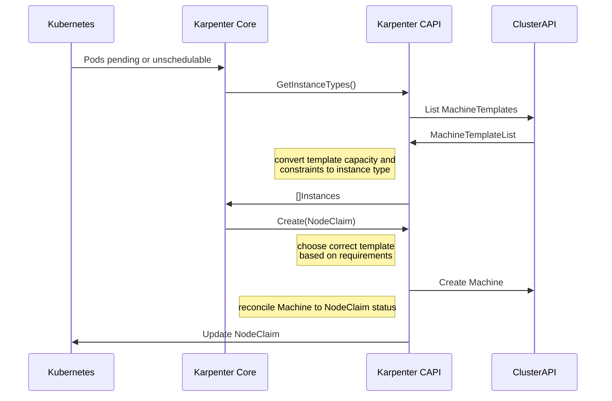

# Design

As of the first half of 2024, this project is under active design and experimentation.
The documentation here captures some of the design notes and decisions.

## MachineDeployment

After the discussions on [4 April 2024][april4], we are revisiting the idea of using MachineDeployments as the backing implemetation detail for NodeClaims. The diagrams here are updated to reflect those changes.

Of note:

* The ClusterAPINodeClass will contain a label selector and assume MachineDeployment as the type.
* The label selector in the ClusterAPINodeClass will be used as the filter for finding MachineDeployments

### Implementation details

### Label for participating resources

To quickly filter Cluster API resources that are used by karpenter, the label `node.cluster.x-k8s.io/karpenter-member` will be used on MachineDeployments and Machines.

Applying this label will be a user task and it should be added to the `.metadata.labels` and the `.spec.template.metadata.labels` of the MachineDeployment.

#### Node labels

To inform about the labels that will be on a node, the provider will translate the [Cluster API propagated labels][plabels] and the [scale-from-zero label annotations][sfza] from the MachineDeployment. 

In cases where the scale-from-zero annotation is used to indicate labels, those labels will override any of the propagated labels.

Initially, this can be used to provide the zone and instance type information required by karpenter.

#### Capacity information

To inform about the capacity of an instance type, and by extension the node it creates, the [scale-from-zero capacity annotations][sfza] will be used initially. In this manner a capacity resource list can be resolved for each scalable resource type from Cluster API.

### General resource relationships

a possible workflow for creating new instances

## InfrastructureMachineTemplate

The section highlights a design pattern that uses an orphan machine methodology to create instances for NodeClaims.
This design was [presented at the 4 April 2024 office hours][april4] - [slides](assets/Proof of Concept Architecture for Karpenter Cluster API.pdf).

This is a class diagram showing the relationships between the Karpenter
and Cluster API CRDs.

This is the sequence diagram for what a request to create a new Node might
look like.

[april4]: https://youtu.be/xINYfl5j8WI?si=PiWu7MeaXy3SWGKX&t=1281
[sfz]: https://github.com/kubernetes-sigs/cluster-api/blob/main/docs/proposals/20210310-opt-in-autoscaling-from-zero.md
[plabels]: https://cluster-api.sigs.k8s.io/developer/architecture/controllers/metadata-propagation.html?highlight=metadata#metadata-propagation
[sfza]:
