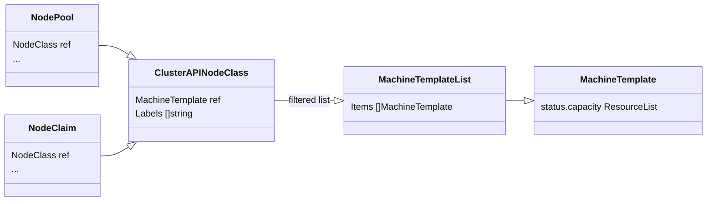
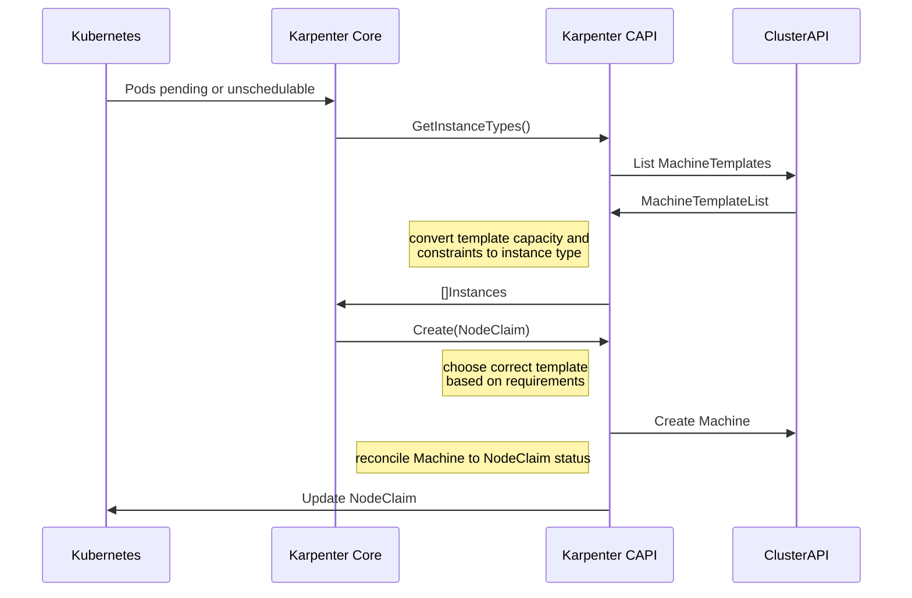

# Design

As of the first half of 2024, this project is under active design and experimentation.
The documentation here captures some of the design notes and decisions.

## InfrastructureMachineTemplate

The section highlights a design pattern that uses an orphan machine methodology to create instances for NodeClaims.
This design was [presented at the 4 April 2024 office hours](https://youtu.be/xINYfl5j8WI?si=PiWu7MeaXy3SWGKX&t=1281)
- [slides](assets/Proof of Concept Architecture for Karpenter Cluster API.pdf).

This is a class diagram showing the relationships between the Karpenter
and Cluster API CRDs.

This is the sequence diagram for what a request to create a new Node might
look like.

