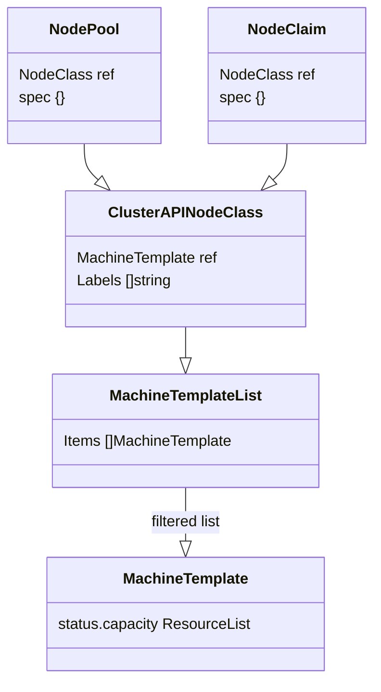
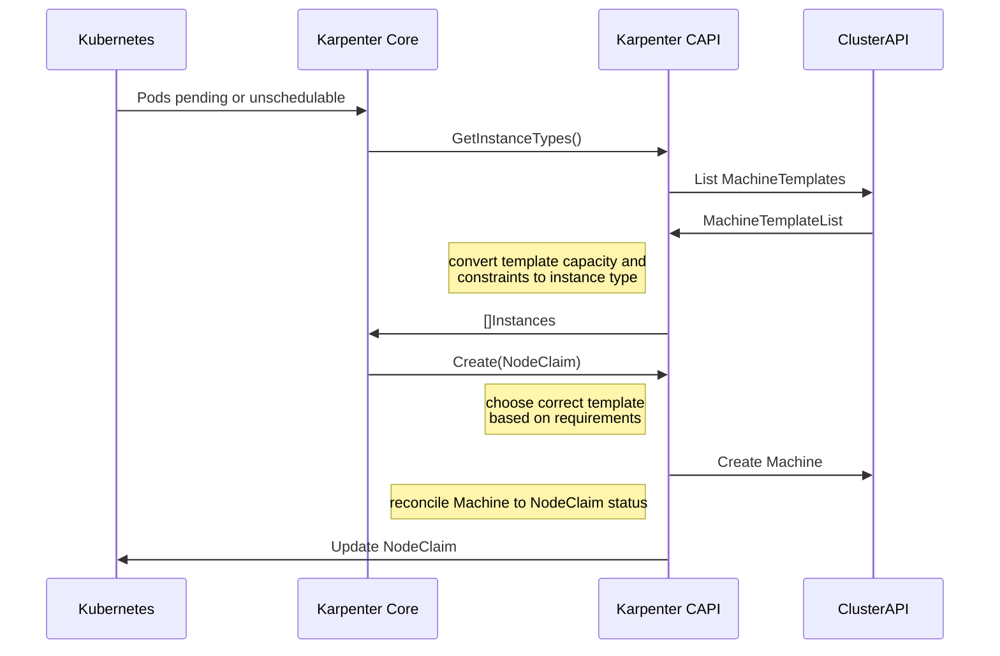

# Design

This is a class diagram showing the relationships between the Karpenter
and Cluster API CRDs.

```mermaid
classDiagram
    NodePool : NodeClass ref
    NodePool : spec {}
    ClusterAPINodeClass : MachineTemplate ref
    ClusterAPINodeClass : Labels []string
    NodePool --|> ClusterAPINodeClass
    NodeClaim : NodeClass ref
    NodeClaim --|> ClusterAPINodeClass
    NodeClaim : spec {}
    MachineTemplate : status.capacity ResourceList
    MachineTemplateList : Items []MachineTemplate
    ClusterAPINodeClass --|> MachineTemplateList
    MachineTemplateList --|> MachineTemplate : filtered list
```

This is the sequence diagram for what a request to create a new Node might
look like.

```mermaid
sequenceDiagram
    participant Kubernetes
    participant Karpenter Core
    participant Karpenter CAPI
    participant ClusterAPI
    Kubernetes->>Karpenter Core : Pods pending or unschedulable
    Karpenter Core->>Karpenter CAPI : GetInstanceTypes()
    Karpenter CAPI->>ClusterAPI : List MachineTemplates
    ClusterAPI->>Karpenter CAPI : MachineTemplateList
    Note left of Karpenter CAPI : convert template capacity and<br />constraints to instance type
    Karpenter CAPI->>Karpenter Core : []Instances
    Karpenter Core->>Karpenter CAPI : Create(NodeClaim)
    Note left of Karpenter CAPI : choose correct template<br />based on requirements
    Karpenter CAPI->>ClusterAPI : Create Machine
    Note left of Karpenter CAPI: reconcile Machine to NodeClaim status
    Karpenter CAPI->>Kubernetes: Update NodeClaim
```
